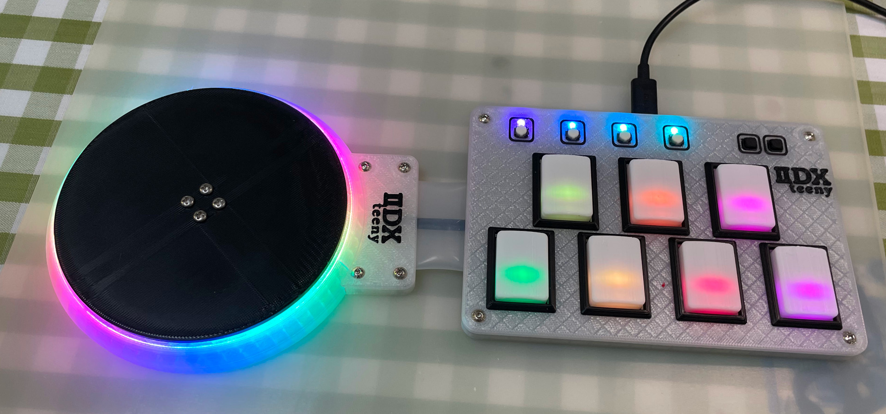
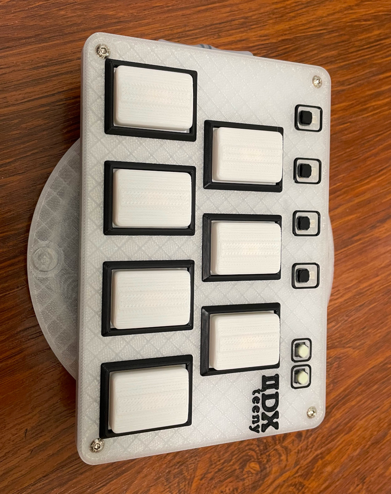
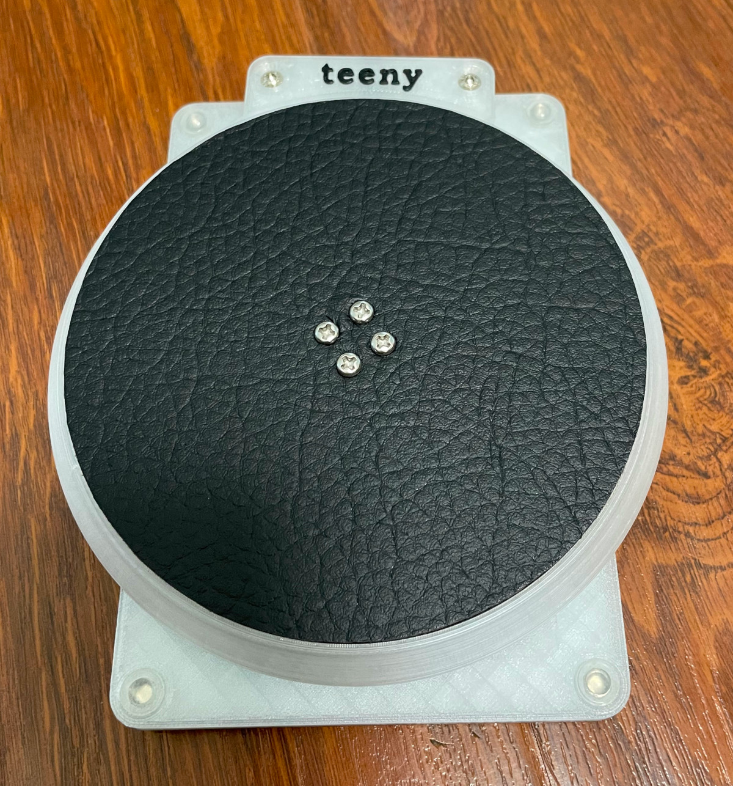
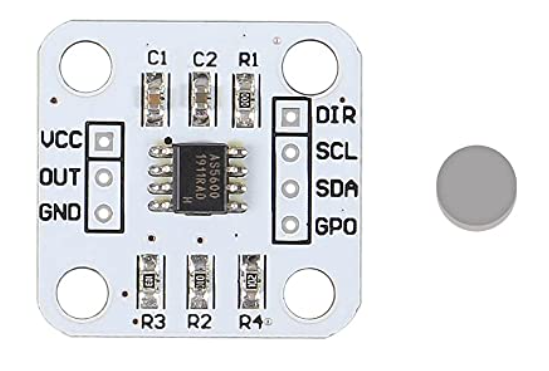
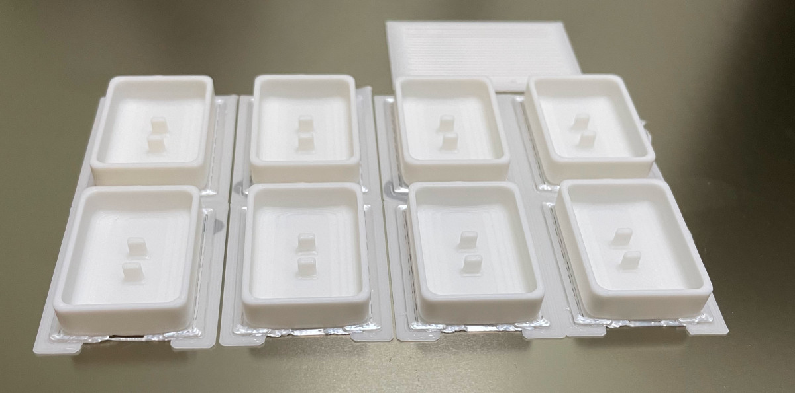
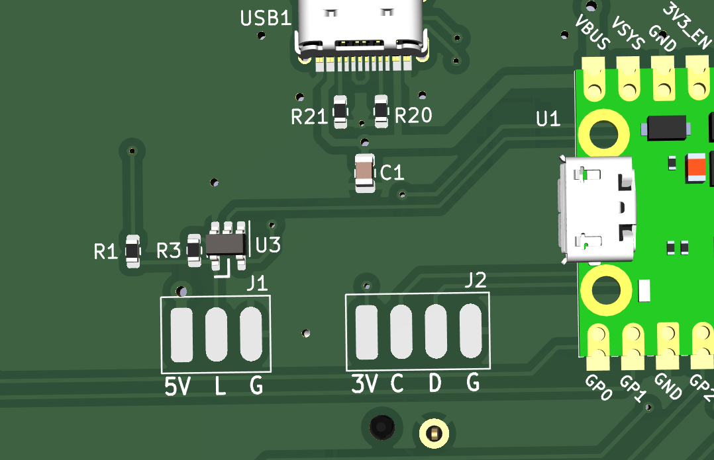

# Teeny IIDX - Beatmania IIDX controller

This is the a small brother of my previous Pico IIDX controller. Both Pico IIDX and this Teeny IIDX share the same firmware which is in Pico IIDX repo.
<https://github.com/whowechina/iidx_pico>

Here's me playing Konami's Beatmania IIDX ultimate mobile with it. Yes, I'm a cat lover.

https://github.com/whowechina/iidx_teeny/assets/11623830/5aea28e7-6961-4d22-b5de-0fad74cdeacf

Features:
* It's thin, really really thin and foldable.
* HID lights, of course!
* Multiple turntable effects.
* Many live settings.
* All source files open.
* It's easier and more portable than IIDX Pico.

Thanks to many respectful guys/companies who made their tools or materials free or open source (KiCad, OpenSCAD, InkScape, Raspberry things).

## Notes
This project heavily relies on 3D printing, and skills to solder tiny components and thin cables.

Also, you can check out my other cool projects.

* Popn Pico: https://github.com/whowechina/popn_pico  

* IIDX Pico: https://github.com/whowechina/iidx_pico  

* Chu Pico: https://github.com/whowechina/chu_pico  

## **Disclaimer** ##
I made this project in my personal time with no financial benefit or sponsorship. I will continue to improve the project. I have done my best to ensure that everything is accurate and functional, there's always a chance that mistakes may occur. I cannot be held responsible for any loss of your time or money that may result from using this open source project. Thank you for your understanding.

## HOW TO BUILD
### Turntable Materials
* 1x AS5600 hall angular sensor board set (23mm\*23mm)  
  
* 1x 6mm\*2mm magnet (must be radially magnetized), normally comes with the AS5600 board set, you can use one with different size of course, but you need to modify the 3D file.
* 1x 61804-2RS deep groove ball bearing (20x32x7mm), normally < 5US$;
* 1x WS2812B LED ring board, or RGB LED strip (recommended). Choose ones with dense LED arrangement (better if >=24 LEDs per board, or >90 LEDS per meter for LED strip);
* 6x M3*6mm screws (large flat head is better) and hex nuts.
* Non slip self-adhesive silicon pads (7-8mm diameter, also for Keyboard).  

### Keyboard Materials
* 1x Raspberry Pi Pico or Pi Pico W (if you need Bluetooth support).  
  https://www.raspberrypi.com/products/raspberry-pi-pico
* 7x Kailh Choc v1 key switches, to get better play feel, 7 of them should be linear (35gf to 50gf).  
  https://www.kailhswitch.com/mechanical-keyboard-switches/low-profile-key-switches/burnt-orange-switch.html  
* 6x Panasonic 6mm square tactile switch EVQP1K05M or a similar Alps one.  
  https://www3.panasonic.biz/ac/e/dl/catalog/index.jsp?series_cd=3473&part_no=EVQP1K05M
* 1x USB Type-C socket (918-418K2023S40001 or KH-TYPE-C-16P)
* 18x WS2812B-3528 RGB LEDs to light up the keys.
* 2x SN74LV1T34DBVR (SOT-23-5) level shifters.
* 1x 0603 5.1kohm resistors for USB.
* 5x 0805 1uF capacitors.
* 4x M3*6mm screws and hex nuts to fix parts together.

### Connection for Foldable
* 2x silicon shielded cables with 4 core cables (about 25cm each), one for the RGB LEDs and one for the sensor.
* 1x silicon tube, outer diameter 27mm, inner diameter 25mm, so the wall thickness is 1mm.

### Step 1 - Buy
* Keyboard PCB  
  Just go [JLC](https://jlcpcb.com/) and make the order. Make sure the board thickness is **1.2mm**, it's very very important!

### Step 2 - 3D Print
#### Keyboard
Print with PLA transparent materials, 0.2mm layer, 4 walls, using 0.4mm nozzle.
* PCB bottom (teeny_bottom_P1|P2.stl, choose one according to your 1P or 2P choice).
* PCB top (teeny_top.stl)  
  Bambu Lab's AMS system is highly recommended, use PLA black for 3.0mm+ layers. So you'll have cool looking logo and key frames.

#### Turntable 
Again, print with 0.2mm layer, using 0.4mm nozzle, 5 walls. "Seam Position" should be set to "**Random**" in your slicer, not only it looks better, it makes the bearing-flange coupling smoother and tension distributed more evenly.  

* Base (teeny_tt.stl), PLA transparent.
* Bearing seat (teeny_bearing.stl), 20-60% fill, PLA white.
* Flange for disc (teeny_shaft.stl), 60% fill, PLA white.
* The disc (teeny_disc.stl), 60% fill, all fill patterns should be set to "Concentric".

#### Button keycaps  
* Print upside down, with easy-to-remove support materials.  
  

### Other Steps
It's similar to my previous Pico IIDX project, just read the documentation there.
<https://github.com/whowechina/iidx_pico>

But there're something you need to pay attention:
* On Teeny's PCB, there are 2 sets of soldering pads, 1 set is for AS5600, the other is for the WS2812 LED ring.
  * J1 is for LED, 5V is the power, L is LED signal, G is ground.
  * J2 is for AS5600, 3V is the power (actually 3.3V), S is I2C SCL, D is I2C SDA, G is ground.
  
  * Please use two seperate cables to wire LED and AS5600, both (or at least one) should be shielded to prevent crosstalk interference.
  * Choose thin/soft cables, so they can fit. Get ultra thin USB cable or extract daughter cables from abandoned HDMI cables. 2mm diameter is the best.
  * Solder either U3 (level shifter, recommended) or R3 (around 10ohm, works most time), but NOT both.
  * Don't solder R1, it was reserved for some experiments and I forgot to remove it.
* There's a nice and overly complicated manual in IIDX Pico's repo, under doc folder. Follow the manual to set AS5600 to I2C mode and then do your LED ring setup.  
<https://github.com/whowechina/iidx_pico/doc/Firmware_manual.pdf>

#### About the License
It's CC-NC. So diy for yourself and for your friend, don't make money from it.
